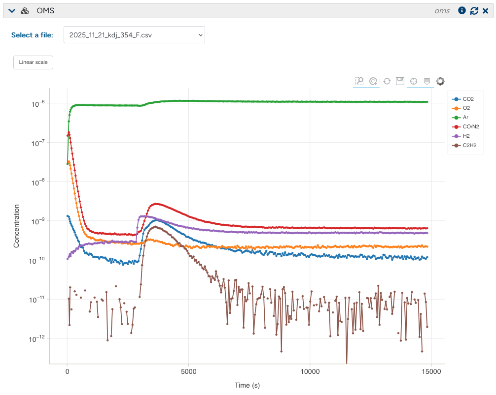

# <div align="center"><i>datalab-app-plugin-oms</i></div>

<div align="center">
<a href="https://github.com/datalab-industries/datalab-app-plugin-oms/releases"></a>
<a href="https://github.com/datalab-industries/datalab-app-plugin-oms/blob/main/LICENSE"></a>
<a href="https://datalab-industries.github.io/datalab-app-plugin-oms"></a>
</div>
A Python plugin for processing and visualising Online Mass Spectrometry (OMS) data within [_datalab_](https://github.com/datalab-org/datalab) instances.

The project is being developed as part of the [FAST (Formation and Ageing for Sustainable Battery Technologies) Faraday](https://www.faraday.ac.uk/research/sustainable-manufacture-scaleup-and-recycling/fast/) work package, by [datalab industries ltd.](https://datalab.industries).

## Features

- Processes and plots data from OMS.
- Handles both the final .csv export of the experiment and the live updating .dat binary file. (See [Data Format](data_format.md) for more information).
- Plots species concentrations on a linear or log scale.
- Can perform calibrations given the relevant calibration data to convert pressure to nmol/s
- Extracts useful parameters such as peak rate, total integral (total nmol over the course of the experiment), and the initial rate (the rate within a user defined time window) and stores these in the block metadata.



## Usage

The plugin provides three parser functions for OMS file formats (see [Data Format](docs/data_format.md) for format details):

### `parse_oms_csv(filename, auto_detect_header=True)`

Parses the standard `.csv` export. Automatically detects the header size by searching for the `"header"` line in the first 10 lines, then reads the data table below it. Returns a DataFrame with a `Time (s)` column (converted from milliseconds) and one column per species.

### `parse_oms_dat(filepath, csv_filepath=None, num_species=None, species_names=None)`

Parses the `.dat` binary file (46-byte records starting with `V1` markers). Since the binary format does not contain species names or counts, the number of species is resolved in priority order:

1. **`num_species`** — explicitly provided by the user.
2. **Companion `.csv` file** — if `csv_filepath` is given (or a `.csv` with the same base name exists), the species count and names are read from its columns.
3. **Auto-detection** — tests candidate species counts and picks the one that produces the smoothest signal.

When a companion CSV is available, species names are matched to binary channels by comparing first-row values. Returns a DataFrame indexed by `Data Point` (sequential index, since `.dat` files contain no timestamps).

## Roadmap

This plugin is still in active development, here are some planned improvements:
- ✓ Record and save key characteristics about the data (e.g Total integral or the gradient of peaks).
- ✓ Automatic calibration by comparing to reference files.
- Integrate other Mass Spectrometry manufacturers to allow comparison between instruments.

# Installation

The `datalab-app-plugin-oms` package can be installed from https://github.com/datalab-industries/datalab-app-plugin-oms.

## Development installation

We recommend you use [`uv`](https://astral.sh/uv) for managing virtual environments and Python versions.

Once you have `uv` installed, you can clone this repository and install the package in a fresh virtual environment with:

```shell
git clone git@github.com:datalab-industries/datalab-app-plugin-oms
cd datalab-app-plugin-oms
uv sync --all-extras --dev
```

You can activate `pre-commit` in your cloned repository with `uv run pre-commit install`.

You can run the tests using `pytest`

```shell
uv run pytest
```

## License

This plugin is released under the MIT license. Please see [LICENSE](LICENSE) for the full text of the license.


datalab-app-plugin-oms is a [*datalab*](https://datalab-org.io) plugin generated using the [datalab-app-plugin-template](https://github.com/datalab-org/datalab-app-plugin-template) template.


Releases are created via semantic version tags on GitHub, and will require manually updating the CHANGELOG.
